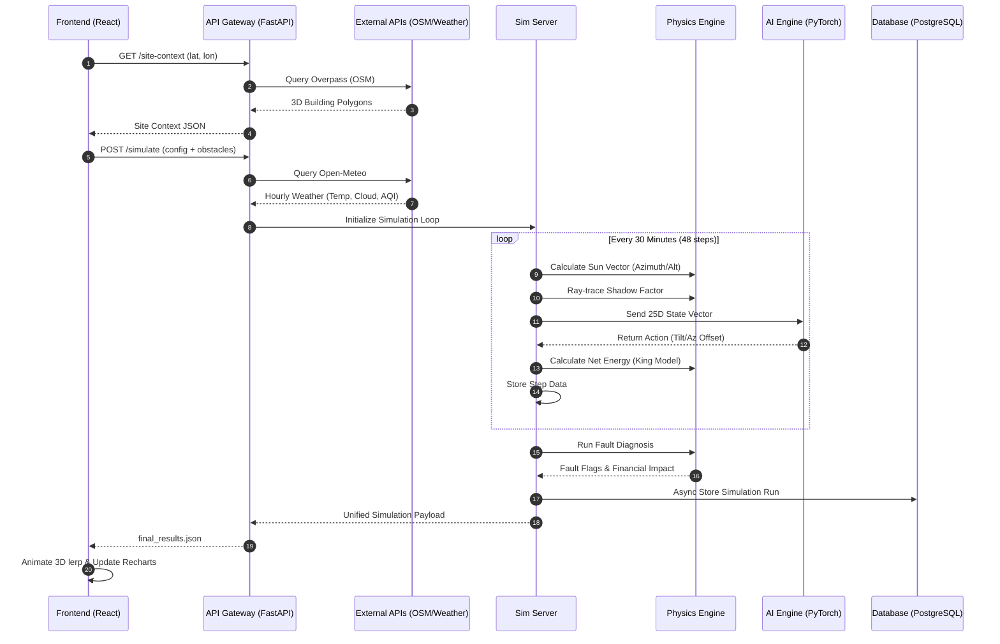

# Data Flow: The Simulation Lifecycle

## 1. Request Initiation
The data lifecycle begins when a user interacts with the **Leaflet map** on the frontend. The system translates the selected geospatial coordinates into a multi-stage data gathering sequence.

## 2. Sequence Diagram (Mermaid)

## 3. Data Transformation Stages

### 3.1. Raw Ingestion
- **Coordinates:** `[Latitude, Longitude]`
- **OSM Data:** XML/JSON footprints representing building nodes and tags (`height`, `levels`, `roof:shape`).
- **Weather Data:** Time-series arrays of `direct_radiation`, `diffuse_radiation`, `wind_speed_10m`, and `temperature_2m`.

### 3.2. Physics-Inference State
Before the AI policy is queried, the raw data is transformed into a **normalized state tensor**.
- **Temporal Vectors:** Hour and day are converted into Sine/Cosine pairs to preserve cyclical continuity (e.g., ensuring 23:30 is mathematically "close" to 00:30).
- **Geometric Vectors:** Sun positions are normalized relative to the horizon and local solar noon.
- **Occlusion Vectors:** Hard and soft shadow factors (0.0 to 1.0) are calculated using a vector-based ray-tracer.

### 3.3. Analytics Output
The raw energy numbers (`Watts`) are post-processed into high-level business metrics:
- **Baseline Comparison:** `energy_tracker / energy_fixed` ratio.
- **Performance Ratio (PR):** Net energy yield relative to theoretical clear-sky maximum.
- **Financial Loss:** Calculated as `(Expected_Yield - Actual_Yield) * Local_Tariff`.

## 4. Export Layers
Helios-X supports heterogeneous data consumers:
- **Web UI:** Optimized JSON for Recharts and Three.js.
- **Database:** Structured relational data for historical trend analysis.
- **MATLAB/Simulink:** Deep-nested JSON compatible with `jsondecode`, enabling researchers to import simulation results directly into MATLAB Simscape Electrical for further grid-stability modeling.

## 5. Error Propagation and Fault Tolerance
- **API Fallbacks:** If the primary weather API (Open-Meteo) fails, the `WeatherService` automatically fails over to OpenWeatherMap or localized procedural defaults.
- **Data Coercion:** The backend employs strict TypeGuards (Pydantic) to ensure that `NaN` or `null` values from external sensors are coerced into safe physical constants before entering the simulation loop.
