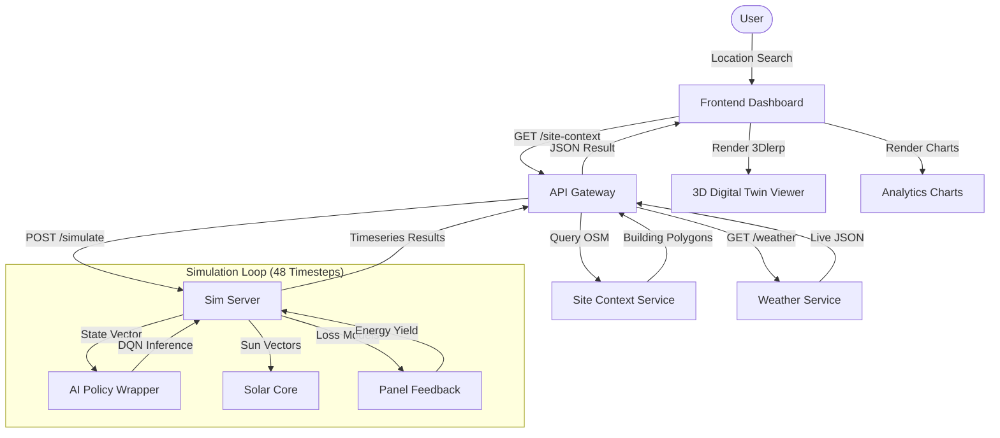

# System Design: Helios-X Architecture

## 1. Architectural Philosophy
Helios-X is built on a **modular microservice architecture**, emphasizing the separation of physical modeling, data ingestion, and AI inference. This decoupled design allows for independent scaling of the physics engine (CPU-bound) and the AI model (GPU/RAM-bound).

## 2. Component Breakdown

### 2.1. Backend Microservices (FastAPI)
The backend is the "brain" of the Digital Twin, orchestrating several internal subsystems:

- **API Gateway (`serve_dashboard.py`):** Handles CORS, async routing, and serves the static frontend in production environments.
- **Simulation Server (`heliosx_sim_server.py`):** The central controller that executes the 48-step simulation loop. It manages state between the physics engine and the RL policy.
- **Physics Engine (`src/physics_engine/`):**
    - `solar_core.py`: Implements sun position vectors using astronomical declination and hour angles.
    - `panel_feedback.py`: Calculates energy yield using the King Thermal Model and AQI-based spectral correction.
    - `fault_diagnosis.py`: Anomaly detection using heuristic comparisons between baseline and actual yield.
- **Data Connectors (`src/services/`):**
    - `weather_service.py`: Multi-source weather API client with LRU caching.
    - `site_context.py`: OpenStreetMap Overpass client for building footprint extraction.

### 2.2. AI Inference Engine (PyTorch)
The AI layer (`heliosx_ai_policy.py`) acts as a wrapper for the **Double DQN model**.
- **State Normalizer:** Transforms raw physical metrics into a 25D state vector.
- **Regime Embedding:** Uses `climate_similarity.py` to calculate Euclidean distances to 6 global climate clusters, providing the model with "contextual awareness" of its geographic deployment.
- **Action Decoder:** Translates discrete network outputs into mechanical `tilt_bias` and `azimuth_bias` commands.

### 2.3. Frontend Digital Twin (Next.js & Three.js)
The frontend provides a real-time, interactive representation of the backend's state.
- **Dashboard:** React-based UI for location search and telemetry display.
- **3D Viewer (`DigitalTwin3D.tsx`):** A high-performance WebGL scene using **React Three Fiber**.
    - Renders extruded OSM building footprints as 3D geometry.
    - Implements **linear interpolation (lerp)** to smooth the transition between 30-minute simulation intervals, creating fluid motion at 60 FPS.
    - Visualizes dynamic volumetric sun rays using a custom ray-casting shader.

## 3. Technology Stack
| Layer | Technology |
|---|---|
| **Language** | Python 3.10+, TypeScript |
| **Backend Framework** | FastAPI (Async) |
| **Machine Learning** | PyTorch (Double DQN) |
| **3D Rendering** | Three.js / React Three Fiber |
| **Database** | PostgreSQL / SQLite (SQLAlchemy) |
| **Styling** | TailwindCSS |
| **Maps** | Leaflet / OpenStreetMap |

## 4. System Flowchart (Mermaid)

## 5. Deployment Strategy
The system is fully containerized using **Docker Compose**, separating the application into three services:
1. `db`: Persistence layer.
2. `backend`: Python API and Physics engine.
3. `frontend`: Next.js web application.
This structure ensures that the system is platform-agnostic and ready for cloud scaling (e.g., Kubernetes).
