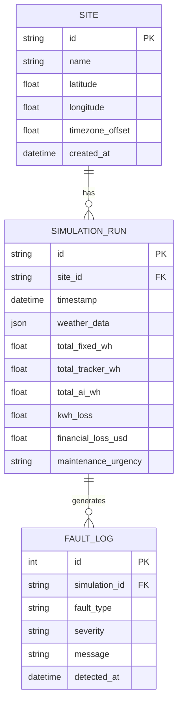

# Database Schema: Helios-X Persistence Strategy

## Overview
Helios-X uses a PostgreSQL database with SQLAlchemy (Async) as the Object-Relational Mapper (ORM). The schema is designed to store geographic site metadata, historical simulation results, and diagnostic fault logs for long-term performance tracking and trend analysis.

## Entity Relationship Diagram
The following diagram illustrates the relationships between the core entities.

## Data Models

### 1. Site
The `Site` model represents a physical location where solar assets are deployed.
*   **Purpose:** Stores static geographic coordinates used for solar math and weather API calls.
*   **Key Fields:** `latitude`, `longitude`, `timezone_offset`.

### 2. SimulationRun
The `SimulationRun` model captures a single execution of the physics engine for a 24-hour period.
*   **Purpose:** Stores both the raw input environment (`weather_data` as JSON) and the aggregated performance metrics.
*   **Performance Metrics:** Stores `total_fixed_wh`, `total_tracker_wh`, and `total_ai_wh` for comparative analysis.
*   **Commercial Impact:** Calculated fields like `financial_loss_usd` help prioritize O&M (Operations and Maintenance).

### 3. FaultLog
The `FaultLog` model records anomalies detected during the simulation.
*   **Purpose:** Provides a granular history of system issues (e.g., "Critical Shading", "Efficiency Drop").
*   **Severity Levels:** Typically `Low`, `Medium`, `High`, or `Critical`.

## Persistence Strategy
1.  **Async Operations:** All database interactions utilize `SQLAlchemy.ext.asyncio` to prevent blocking the FastAPI event loop during heavy I/O.
2.  **Alembic Migrations:** Schema changes are managed via Alembic (see `alembic.ini` and `alembic/` directory) to ensure consistent deployments across staging and production.
3.  **JSON Storage:** The `weather_data` field in `SimulationRun` uses the Postgres `JSONB` type for efficient querying and flexibility as weather models evolve.
4.  **UUIDs:** Primary keys for `Site` and `SimulationRun` are generated as UUID strings to avoid ID collision across distributed collectors.
