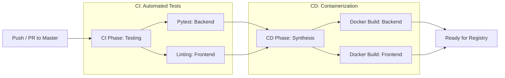

# CI/CD Pipeline: Continuous Integration and Deployment Methodology

## Abstract
This document details the Continuous Integration and Continuous Deployment (CI/CD) pipeline for the Helios-X project. It outlines the automation workflows that ensure code quality, functional correctness, and deployment readiness through rigorous testing and container image synthesis.

## 1. Pipeline Overview
The Helios-X CI/CD infrastructure is powered by GitHub Actions, providing a unified automation plane for both the backend physics engine and the frontend visualization dashboard. The pipeline is triggered on every `push` and `pull_request` to the `master` branch.

## 2. Continuous Integration (CI)
The CI phase is designed to detect regressions early in the development lifecycle.

### 2.1 Backend Validation (`test-backend`)
The backend CI job executes the following steps:
1.  **Environment Provisioning:** Spin up an `ubuntu-latest` runner with Python 3.11.
2.  **Dependency Management:** Install requirements via `pip`.
3.  **Unit and Integration Testing:** Execute the `pytest` suite.
    *   **In-Memory Database Strategy:** To ensure isolation and speed, the tests utilize an in-memory SQLite database (`sqlite+aiosqlite:///:memory:`). This bypasses the need for a persistent PostgreSQL instance during the test phase, enabling rapid feedback loops.

### 2.2 Frontend Validation (Proposed)
Future iterations will include `npm test` and `eslint` checks to ensure UI consistency and adherence to React performance standards.

## 3. Continuous Deployment (CD)
Upon successful completion of the CI phase, the pipeline transitions to the CD phase for the `master` branch.

### 3.1 Container Synthesis (`build-and-push`)
This job performs the automated synthesis of production-ready Docker images.
*   **Backend Image:** Builds the `heliosx-backend` image using the multi-stage `Dockerfile`.
*   **Frontend Image:** Builds the `heliosx-frontend` image using the Node.js build process.

The automated building of these images ensures that the "environment as code" remains consistent with the source code, eliminating "it works on my machine" discrepancies during deployment.

## 4. Pipeline Flow Diagram

## 5. Security and Compliance
The pipeline integrates security checks by ensuring that:
- Secrets (e.g., API keys, database credentials) are not hardcoded but managed via repository secrets.
- Images are built from minimal base distributions (`slim`, `alpine`) to reduce vulnerability density.

## 6. Conclusion
The Helios-X CI/CD pipeline establishes a robust foundation for iterative scientific development. By automating the path from code commit to container artifact, the project maintains high velocity without compromising the integrity of the digital twin simulation.
