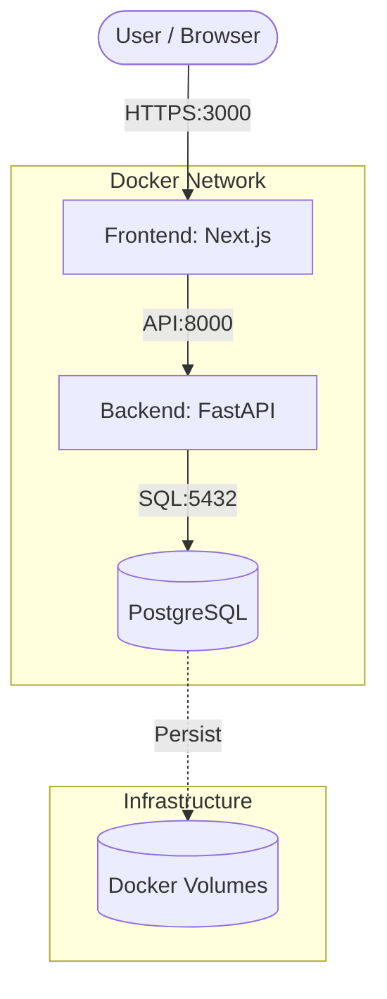

# Containerization Strategy: Helios-X Digital Twin

## Abstract
This document provides a technical analysis of the containerization strategy employed in the Helios-X Digital Twin project. It examines the architectural decisions behind multi-stage Docker builds, image selection, service orchestration, and environment management, following industry best practices for scalable and reproducible research software.

## 1. Architectural Overview
The Helios-X infrastructure is designed as a microservices-inspired architecture, decomposed into three primary layers:
1.  **API Gateway / Physics Engine (Backend):** A high-performance Python-based service.
2.  **Interactive Dashboard (Frontend):** A Next.js application for real-time visualization.
3.  **Persistence Layer (Database):** A PostgreSQL instance for historical simulation data.

## 2. Dockerfile Analysis

### 2.1 Backend: Multi-Stage Optimization
The backend `Dockerfile` implements a dual-stage build process to minimize the final image's attack surface and footprint.

*   **Stage 1: Build Base (`builder`):** Utilizes `python:3.11-slim` with build-time dependencies (`gcc`, `libpq-dev`). This stage compiles necessary Python wheels and installs dependencies into a dedicated `/install` prefix.
*   **Stage 2: Production Release:** Copies only the compiled artifacts and the application code into a fresh `python:3.11-slim` image. This eliminates build-time tools from the production environment, adhering to the principle of least privilege.

```dockerfile
# Simplified representation of the multi-stage logic
FROM python:3.11-slim as builder
...
RUN pip install --prefix=/install -r requirements.txt

FROM python:3.11-slim
COPY --from=builder /install /usr/local
...
```

### 2.2 Frontend: Development and Production Readiness
The frontend leverages `node:20-alpine` to ensure a minimal runtime environment. During development, it utilizes volume mounting for hot-module replacement (HMR), while the production path is optimized for static generation and server-side rendering (SSR).

## 3. Service Orchestration
Orchestration is managed via `docker-compose.yml`, which defines the network topology and dependency graph.

*   **Health-Check Driven Initialization:** The backend service remains in a pending state until the PostgreSQL service reports a healthy status via `pg_isready`.
*   **Network Isolation:** All services communicate over a private bridge network, with only the frontend (3000) and backend (8000) ports exposed to the host for external access.

## 4. Deployment Diagram



## 5. Environment and Configuration
Environment management follows the Twelve-Factor App methodology. Configuration is decoupled from code via `.env` files and Docker environment variables. This allows for seamless transitions between `local`, `staging`, and `production` environments without modifying the container images themselves.

## 6. Conclusion
The containerization strategy for Helios-X prioritizes efficiency, security, and developer productivity. By utilizing multi-stage builds and strict orchestration rules, the project ensures that the digital twin can be deployed reliably across heterogeneous computing environments.
